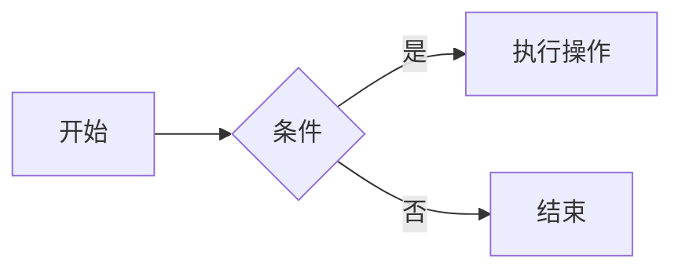
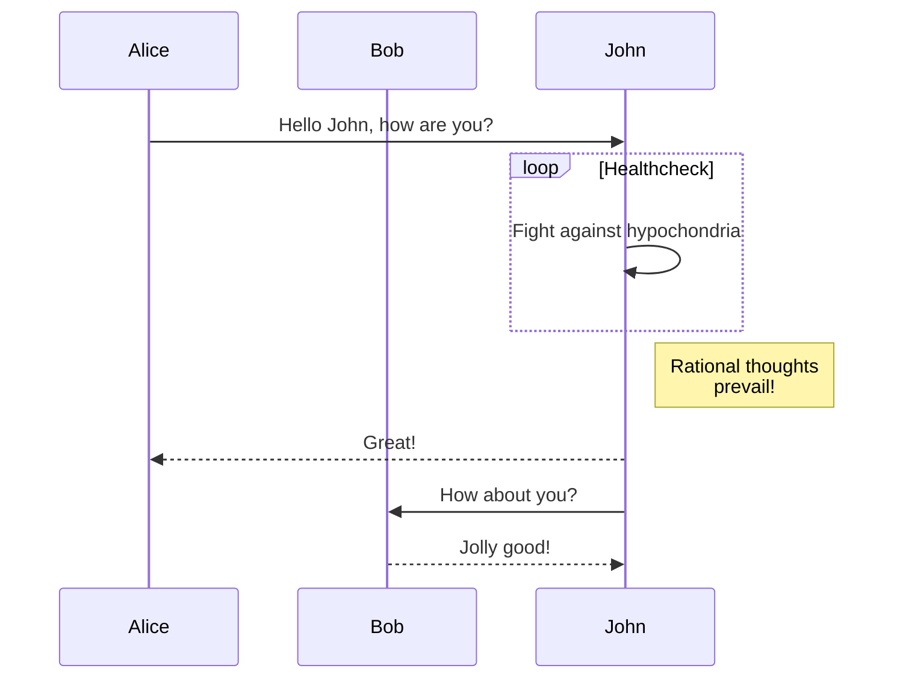
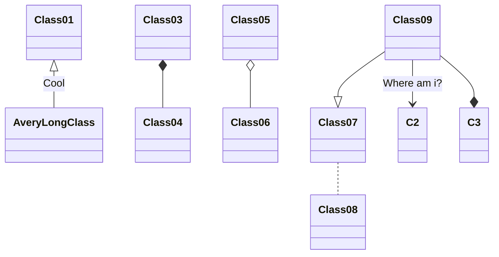
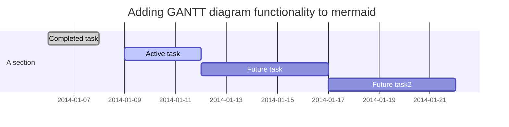

# md 文档知识点

## 1. md 文档下标和上标

```html
<sub>2</sub>
<sup>2</sup>
```

## Markdown如何画时序图

### 流程图



### 序列图



### 类图

表示面向对象系统中的类及其关系。



### 饼图

 ```mermaid
 pie showData
    title Key elements in Product X
    "Calcium" : 40.50
    "Potassium" : 45.5
    "Magnesium" : 10
    "Iron" :  5
```

### 甘特图


