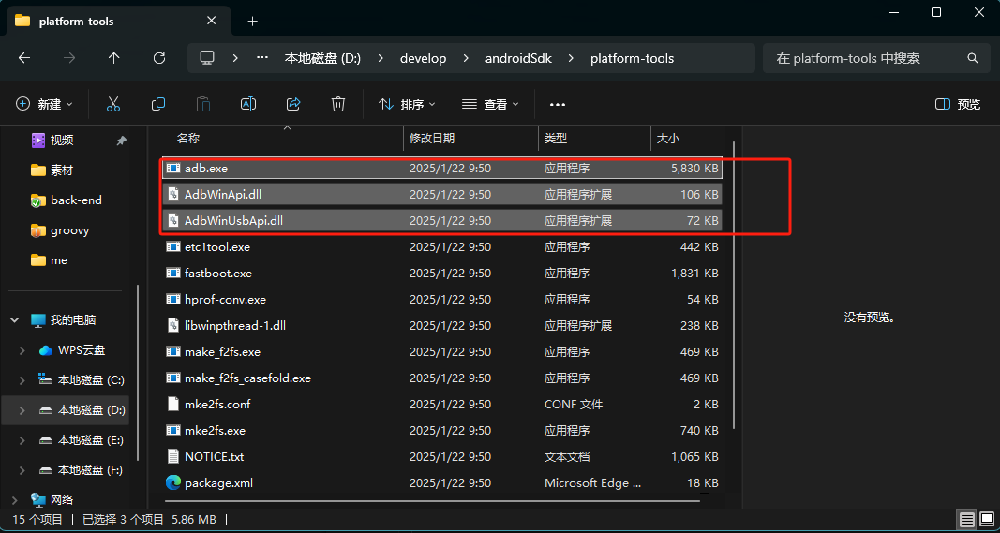

# 配置

## settings.gradle.kts

```kotlin
pluginManagement {
    repositories {
        maven { url = uri("https://maven.aliyun.com/repository/public") }
        maven { url = uri("https://maven.aliyun.com/repository/google") }
        maven { url = uri("https://maven.aliyun.com/repository/gradle-plugin") }
        maven { url = uri("https://dl.bintray.com/kotlin/kotlin-dev") }
        maven { url = uri("https://maven.pkg.jetbrains.space/public/p/compose/dev") }
        google {
            content {
                includeGroupByRegex("com\\.android.*")
                includeGroupByRegex("com\\.google.*")
                includeGroupByRegex("androidx.*")
            }
        }
        mavenCentral()
        gradlePluginPortal()
    }
}

dependencyResolutionManagement {
    repositoriesMode.set(RepositoriesMode.FAIL_ON_PROJECT_REPOS)
    repositories {
        maven { url = uri("https://maven.aliyun.com/repository/public") }
        maven { url = uri("https://maven.aliyun.com/repository/google") }
        maven { url = uri("https://maven.aliyun.com/repository/gradle-plugin") }
        maven { url = uri("https://dl.bintray.com/kotlin/kotlin-dev") }
        maven { url = uri("https://maven.pkg.jetbrains.space/public/p/compose/dev") }
    }
}

rootProject.name = "demo"
include(":app")


```

## 设置 Android Studio 的路径

`flutter config --android-studio-dir "D:\Android\Android Studio"`

## 连接夜神模拟器

- 方法 1: 打开夜神模拟器目录
  `nox_adb.exe connect 127.0.0.1:62001`
- 方法 2 :
  `adb connect 127.0.0.1:62001`
- 方法 3：写脚本 另存为 bat 文件，双击运行即可，编码格式为 ANSI 。

```shell
@echo off
::夜神模拟器适配Android Studio
::以下内容请根据本机实际情况更改

::d是夜神模拟器所在的驱动盘
d:
::再定位到夜神模拟器的bin目录
cd D:\Program Files\Nox\bin
adb.exe connect 127.0.0.1:62001
@echo 适配完毕
pause
```

## android 连接夜神模拟器报 cannot connect to 127.0.0.1:62001: 由于目标计算机积极拒绝，无法连接。 (10061)

**原因解析：**  
adb 版本不对，Android SDK 的版本和模拟器的 adb 版本不一致，使用命令 adb version 查看 Android SDK 的 adb 版本，再使用 Nox_adb version 查看夜神模拟器的 adb 版本。若版本不一致，则采用下述解决方案。  
**解决方案：**  
将 Android SDK 的 adb 替换掉模拟器的 adb 即可。模拟器 adb 路径：{安装 Path}\Nox\bin  
**步骤一**  
找到 Android SDK 的 adb 文件路径：{安装 Path}\android-sdk\platform-tools。将 Android SDK 的 adb 复制到模拟器的 bin 目录下，覆盖原有文件。  
**步骤二**  

将上面三个 adb 文件复制到模拟器的 adb 文件路径下，替换掉模拟器 adb 路径下的文件  
**步骤三**  
将模拟下的 nox_adb.exe 重命名为 nox_adb_back.exe，复制 AS(AndroidStudio)下的 adb.exe 命名为 nox_adb.exe 复制到模拟器下

## 连接 mumu

```bat
@echo off
setlocal

:: 设置目标目录和adb路径
set TARGET_DIR=D:\app\MuMu Player 12\shell
set ADB_EXE=%TARGET_DIR%\adb.exe
set CONNECT_ADDR=127.0.0.1:16384

:: 检查目录是否存在
if not exist "%TARGET_DIR%" (
    echo 错误：目录不存在 - %TARGET_DIR%
    pause
    exit /b 1
)

:: 检查adb.exe是否存在
if not exist "%ADB_EXE%" (
    echo 错误：adb.exe 未在指定目录中找到
    pause
    exit /b 1
)

:: 执行adb连接命令
echo 正在执行 adb 连接...
"%ADB_EXE%" connect %CONNECT_ADDR%

:: 检查命令执行结果
if %errorlevel% equ 0 (
    echo adb 连接命令执行成功
) else (
    echo adb 连接命令执行失败
)

pause
endlocal
```
